# Site info

This website was built to provide visitors with all the information they need to know about the Tefal All-in-One CY505E40 Pressure Cooker, including its features, benefits, and images of the product. I also provided links to the external pages with information about warranty, repairs, manuals, FAQs and contact pages.

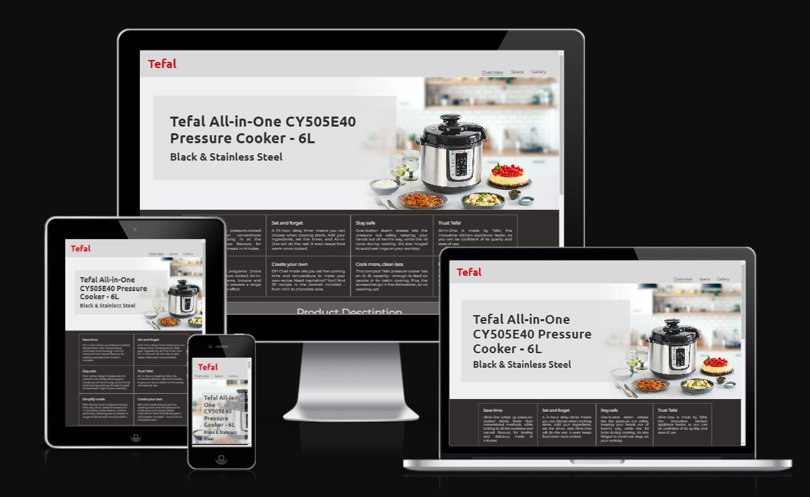

Link to the live site [here](https://slbabin.github.io/multicooker/). 

## Features

The website comprises of three pages: Overview, Specs, Gallery.

To achieve a consistent look and functionality, all three pages have the same sections:
1. A header, which header includes a logo and a navigational bar.
2. A product links section.
3. A footer, which includes a social links bar and a subscribe form.

- __Navigation__

    - The navigational bar is responsive and allows the user to navigate through the site. It highlights the current page with the bottom border. On the left side of the nav bar is located a logo with the home page link, to provide easy way to return to the home page from any other page.

- __The main image section__

    - The main image section consists of the large, background hero image of the product. The image with the gradient effect takes 100% screen width. Its purpose is to catch the user's attention and show the product, as well as to provide an aesthetic look.
    - On the left site of the image there is a text block with the full name of the product. The product name enclosed in the H1 tags and should assist SEO of the site.

 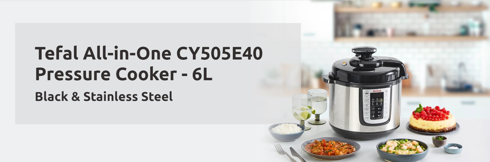

- __Short description section__

     - This section provides information about the main features of the product. The list of features displayed in a grid table.

     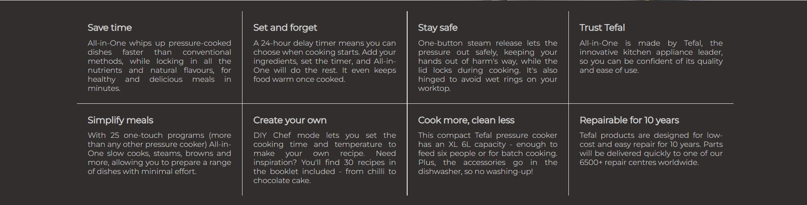
  

 - __Full description section__

     - This section provides more details about the product. It also includes thumbnail images of the product with the zoom-in effect.

     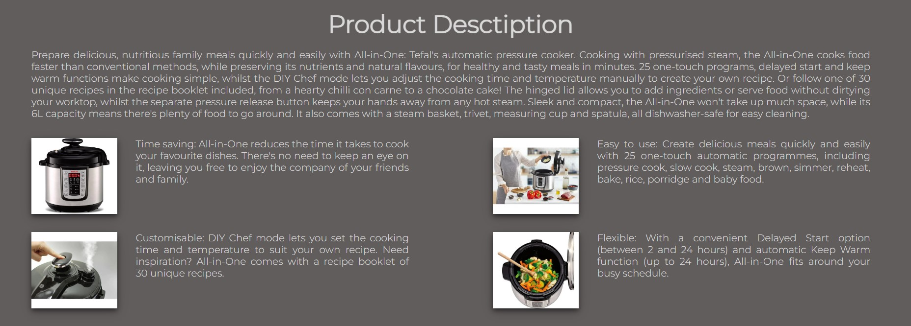 

- __Product links section__

     - This section allows a user to access the manufacturer's site if they need information about a warranty, repairs, manuals, FAQs and contact pages. All links in this sections open in a new browser tab, which allows the user not loose a connection with this site.

         

- __Footer__

     - The footer consist of two section, the social links bar, and the subcscribe form. 
     - All links in the social bar open in a new browser tab.
     - The subscribe form consist of a single required email field and the submit button.

             

- __The Specs page__

     - On this page the user can view technical characteristics of the product, which are presented using a styled table. 
     - A Parallax scrolling was used to achieve the illusion of depth and provide a better user experience.

     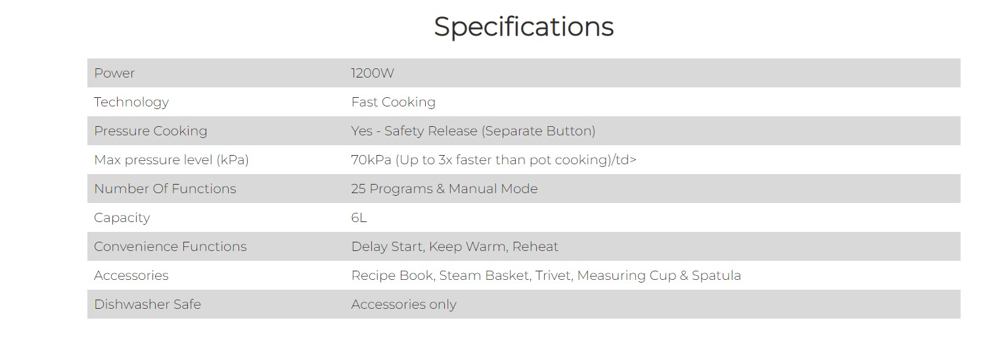  

- __The Gallery page__

     - On this page, the head image was replaced with the video about the product. The video is stretched to 100% of the screen width and displays the product and its abilities in action. 

     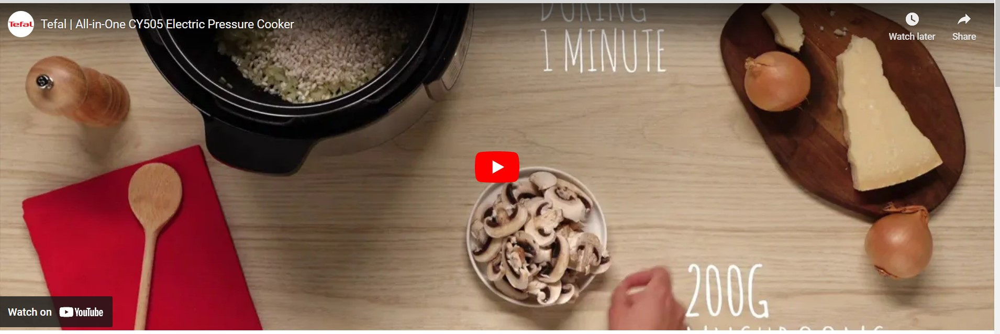 

     - Below the video, located the gallery with images of the product and accessories. The gallery allows to view the image in zoomed up mode when hovering over the image with a mouse. 
     
     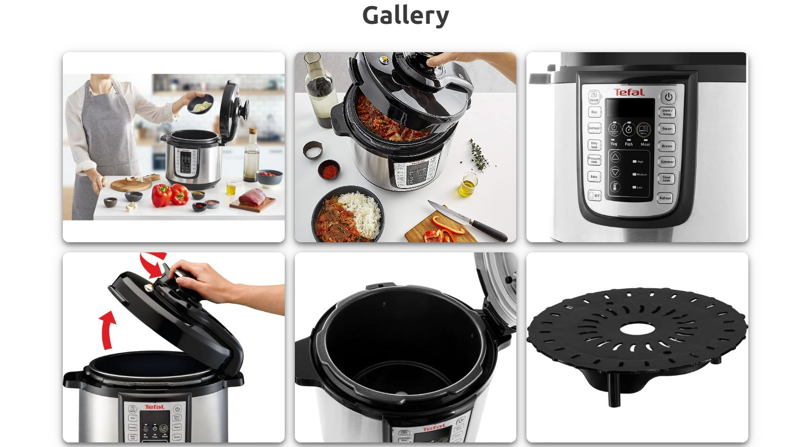  

## Design

- Wireframes

Overview page - Desktop

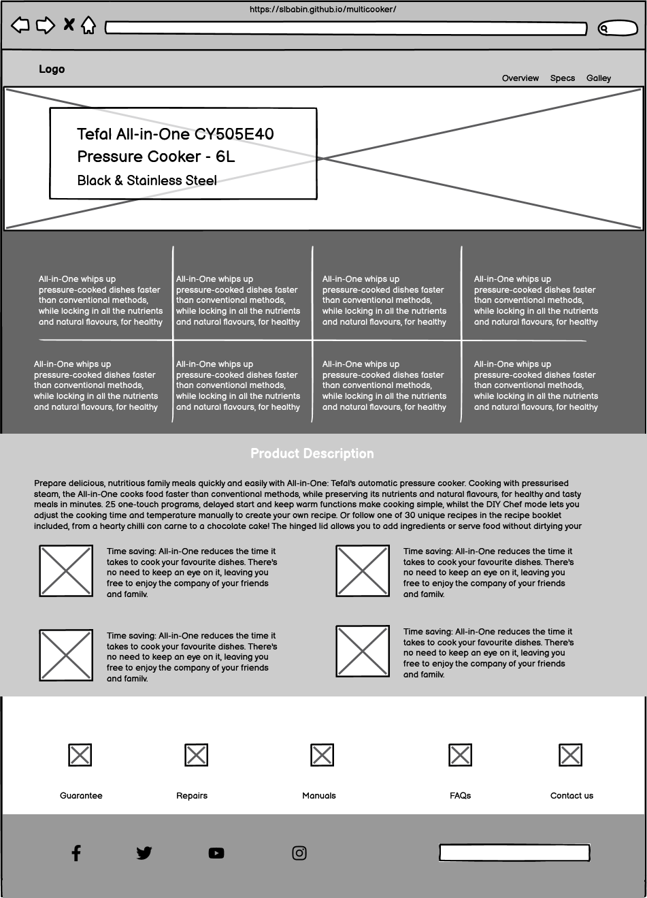

Specs page - Desktop

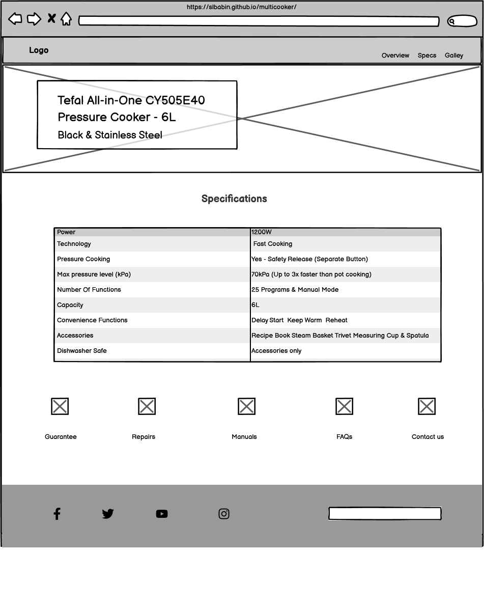

Gallery page - Desktop

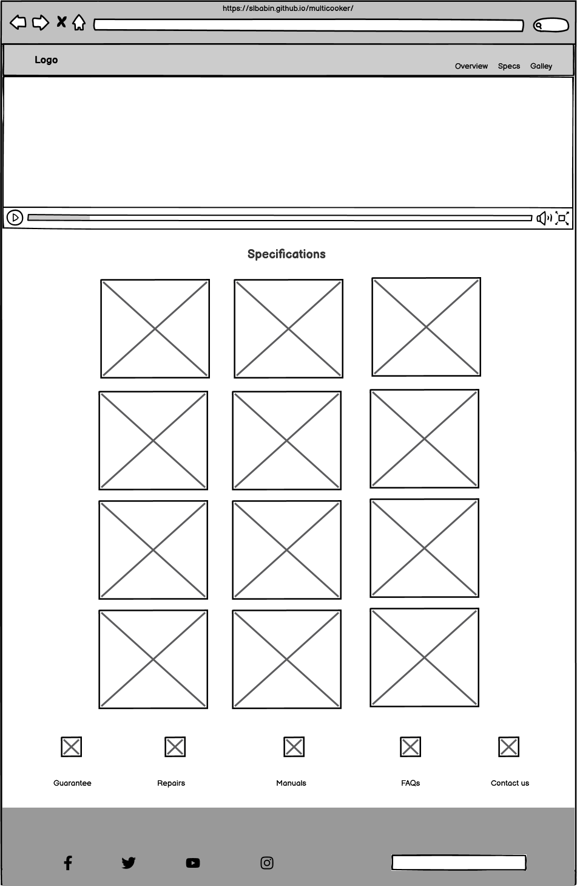

 

Overview page - iPad

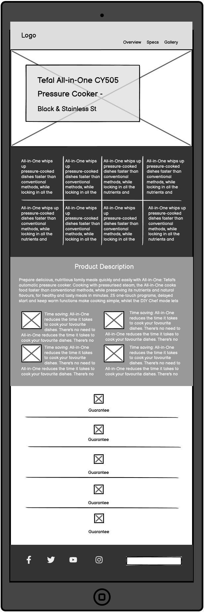

Specs page - iPad

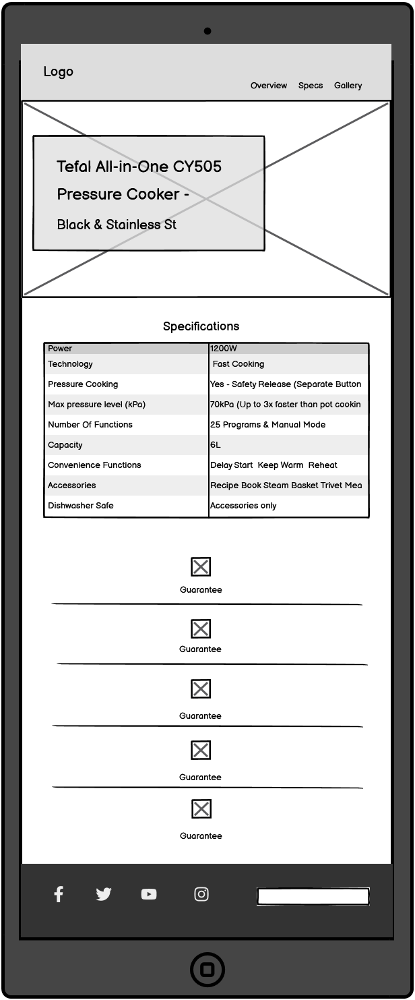

Gallery page - iPad

 

Overview page - Mobile

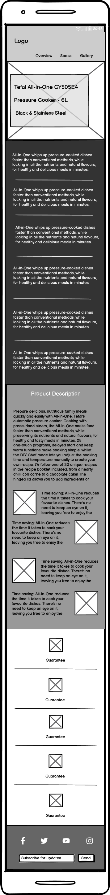

Specs page - Mobile

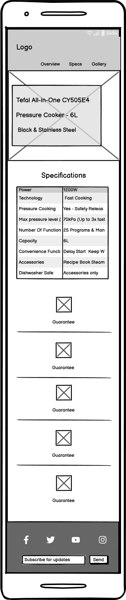

Gallery page - Mobile

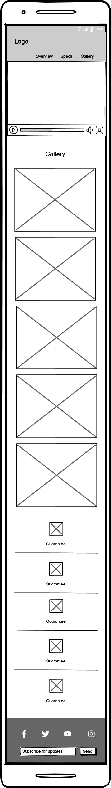

__Colour Scheme__
    - Throughout the site it was used three main colours, dark brown, gray, and white.

__Typography__
    - The Montserrat font was chosen as the main font throughout the whole website due to its clean and attractive design. Sans Serif  was chosen as the fallback font.

## Testing

- The site performance and look was tested in different browsers: Chrome, Firefox, Edge, Opera. 
- In all of the tested browsers the site was responsive and provided a consisted look and performance on different screen sizes.
- I confirmed that all links are properly redirecting to correct pages. The text on all pages is easy readable.  Images are proportional and don't look pixelated.

- The code of all pages was run through the W3C Markup Validator, W3C CSS Validator, and in the Lighthouse devtool services to ensure there were no syntax errors in the project.

HTML5 validation

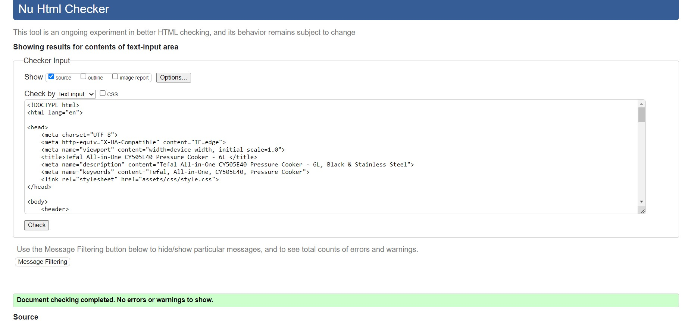

SS3 validation

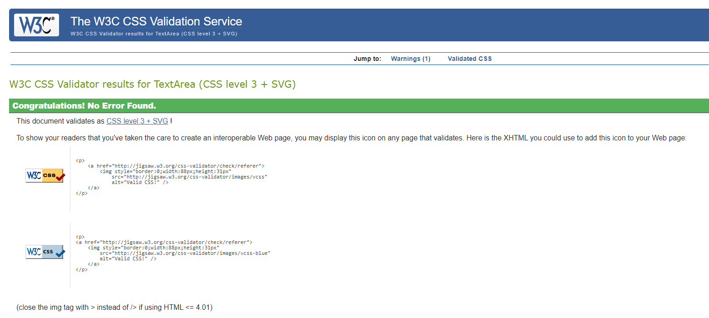

Accecibilty validation in Lighthouse

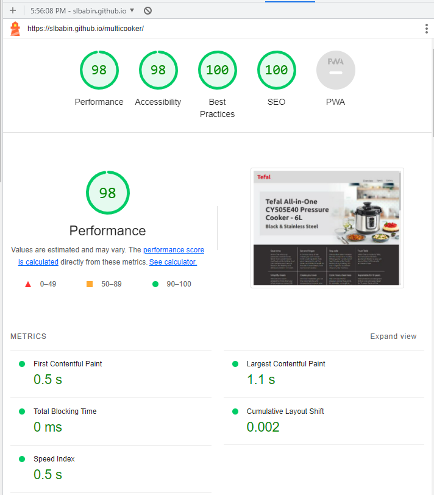

__Bugs__

- When checking the page Specs on a large screen, I  noticed that a margin appeared on the top of the main image section. This margin shifted down the main image container box and it appeared to be cut off from the bottom. I couldn't find what was causing that margin, however, I was able to fix
 this issue by creating an additional breakpoint with the min-width 1900px and adding the background-position-y: 25% attribute to it. 

## Deployment
1. Log in to GitHub and locate the [GitHub Repository](https://github.com/)
2. On the Repository page, click on the "Settings" button.
3. Scroll down to the Pages tab on the left side.
4. Under Branches select Main and click Save.
5. The page will refresh and the link to the site will appear [https://slbabin.github.io/multicooker/](https://slbabin.github.io/multicooker/)

## Technologies Used
Languages Used
- [HTML5](https://en.wikipedia.org/wiki/HTML5)
- [CSS3](https://en.wikipedia.org/wiki/Cascading_Style_Sheets)

 Programs Used
 - [GitHub:](https://github.com/) Used for version control and to store the projects code after being pushed from GitPod or Codeanywhere.

  - [GitPod:](https://gitpod.io/) Used as cloud IDE to write the code and to commit and Push to GitHub.
  - [Codeanywhere:](https://codeanywhere.com/) Alternative cloud IDE to GitPod
  - [Font Awesome:](https://fontawesome.com/) It was used throughout the website to add icons for aesthetic and UX purposes.
  - [Photopea:](https://www.photopea.com/) Online photo editor. Used for editing images.
  - [Balsamiq:] (https://balsamiq.com/wireframes/) Was used to create the wireframes.
  - [Google fonts:](https://fonts.google.com/) Used to import the 'Monserat' font into the style.css file which is used on all pages throughout the project.

## Credits
__Content__
 - The text for the Oveview and the Specs pages was taken from manufacturer's website [Tefal.co.uk](https://www.tefal.co.uk/Cooking-appliances/Pressure-Cookers/Pressure-Cookers/Tefal-All-in-One-CY505-Pressure-Cooker-%E2%80%93-6L-Black-%26-Stainless-Steel-/p/7211003272?scc=pressure-cookers-cat).
 - Instructions on how to create a parallax scroll effect was taken from [https://www.w3schools.com/](https://www.w3schools.com/howto/howto_css_parallax.asp).
 - The gallery  was based on the code taking from [https://dev.to/](https://dev.to/nazanin_ashrafi/create-an-image-gallery-using-flexbox-441a).

__Media__
- Images and the video were taking from [Tefal.co.uk](https://www.tefal.co.uk/Cooking-appliances/Pressure-Cookers/Pressure-Cookers/Tefal-All-in-One-CY505-Pressure-Cooker-%E2%80%93-6L-Black-%26-Stainless-Steel-/p/7211003272?scc=pressure-cookers-cat) and [Amazon.co.uk](https://www.amazon.co.uk/Tefal-CY505E40-Electric-Pressure-Stainless/dp/B07C1MPN1S).