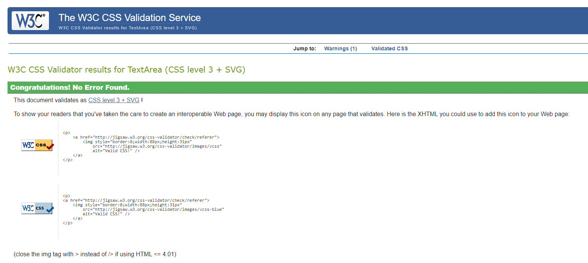

## List of features
## UX/UI
## Testing
## Deployment
## Citation of ALL sources(code,images, text)
## Future features
## Known Bugs

# Site info

This website was built to provide visitors with all the information they need to know about the Tefal All-in-One CY505E40 Pressure Cooker, including its features, benefits, and images of the product. I also provided links to the external pages with information about warranty, repairs, manuals, FAQs and contact pages.

Link to the live site [here](https://slbabin.github.io/multicooker/). 

## Features

The website comprizes of three pages: Overview, Specs, Gallery.

To achieve a consistent look and funtionallity, all three pages have the same sections:
1. A header, which header includes a logo and a navigational bar.
2. A product links section.
3. A footer, which includes a social links bar and a subscribe form.

- __Navigation__

    - The navigational bar is responsive and allows the user to navigate through the site. It highlights the current page with the bottom border. On the left side of the nav bar is located a logo with with the home page link, to provide easy way to return to the home page from any other page.

- __The main image section__

    - The main image section consist of the large, background hero image of the product. The image with the gradient effect takes 100% screen width. Its purpose is to catch the user's attention, and show the product as well as aesthetic look.
    - On the left site of the image there is a text block with the full name of the product. The product name inclosed in the H1 tags and should assist SEO of the site.
 

- __Short description section__

     - This section provides information about the main features of the product. The list of features displayed in a grid table.
     
  

 - __Full description section__

     - This section provides more details about the product. It also includes thumbnail images of the product with the zoom-in effect.
      

   - __Product links section__

     - This section alows a user to access the manufacturer's site if they need information about warranty, repairs, manuals, FAQs and contact pages. All links in this sections open in a new browser tab, which makes the user not loose a connection with this site.
         

    - __Footer__

     - The footer consist of two section, the social links bar, and the subcscribe form. 
     - All links in the social bar open in a new browser tab.
     - The subscribe form consist of a single required email field and the submit button.
             

Main features:

- Responsive design
- Head image with the animation effect
- CSS Gallery 
- Subscribe for updates form

The navigational bar is responsive and allows the user to navigate through the site. It highlights the current page with the bottom border.

The main image section consist of the large, background hero image of the product. The image with the gradient effect takes 100% screen width. Its purpose is to catch the user's attention, and show the product as well as aesthetic look.

The Overview page:

The short description section provided information about the main features of the product.

The Product links section consists of a five external links to the product manufacturer site. 

The Specs page:

This page displays a table with technical characteristics of the product. 

The Gallery page:

On this page, the head image was replaced with the video about the product. This video was streatched to the full width of the screen. 

## UX/UI

### User experience
Website has three pages:
- The Overview page cosists of six sections: Menu, Head image, Short description, Full descripton, Product links, and Social link with the Subscribe for updates form.  
- The Specs page contains a table with tecnical specs of the product.
- The Gallery page displays a video about the product and images.

### Design
Colour Scheme
- Throughout the site it was used three main colours, dark brown, gray, and white.

Typography
- The Montserrat font was chosen as the main font throughout the whole website due to its clean and attractive design. Sans Serif  was chose as the fallback font.

## Wireframes

Overview page - Desktop version

Specs page - Desktop version

Gallery page - Desktop version

 

Overview page - iPad version

Specs page - iPad version

Gallery page - iPad version

 

Overview page - Mobile version

Specs page - Mobile version

Gallery page - Mobile version

## Technologies Used
Languages Used
- [HTML5](https://en.wikipedia.org/wiki/HTML5)
- [CSS3](https://en.wikipedia.org/wiki/Cascading_Style_Sheets)

 Programs Used
 - [GitHub:](https://github.com/) Used for version control and to store the projects code after being pushed from GitPod or Codeanywhere.

  - [GitPod:](https://gitpod.io/) Used as cloud IDE to write the code and to commit and Push to GitHub.
  - [Codeanywhere:](https://codeanywhere.com/) Alternative cloud IDE to GitPod
  - [Font Awesome:](https://fontawesome.com/) It was used throughout the website to add icons for aesthetic and UX purposes.
  - [Photopea:](https://www.photopea.com/) Online photo editor. Used for editing images.
  - [Balsamiq:] Was used to create the wireframes.
  - [Google fonts:](https://fonts.google.com/) Used to import the 'Monserat' font into the style.css file which is used on all pages throughout the project.
  
  ## Testing

  The code of all pages was run through the W3C Markup Validator and W3C CSS Validator Services to ensure there were no syntax errors in the project.

HTML5 validation

SS3 validation

## Deployment
1. Log in to GitHub and locate the [GitHub Repository](https://github.com/)
2. On the Repository page, click on the "Settings" button.
3. Scroll down to the Pages tab on the left side.
4. Under Branches select Main and click Save.
5. The page will refresh and the link to the site will appear [https://slbabin.github.io/multicooker/](https://slbabin.github.io/multicooker/)

